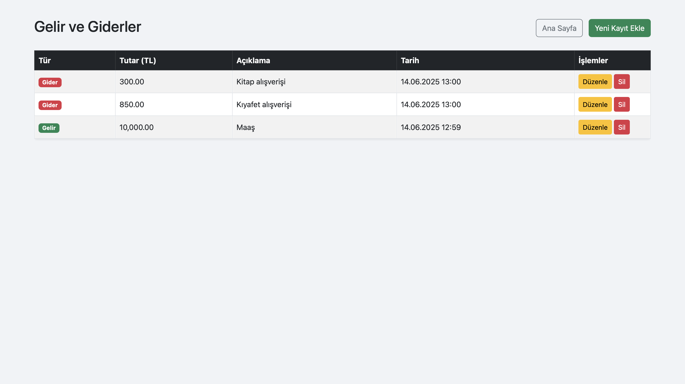
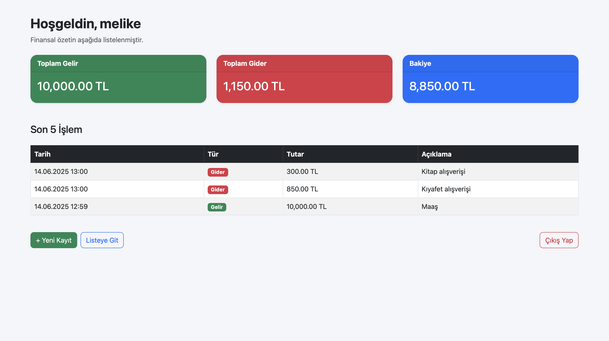
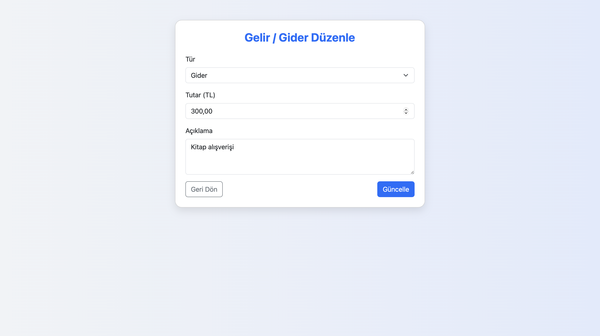
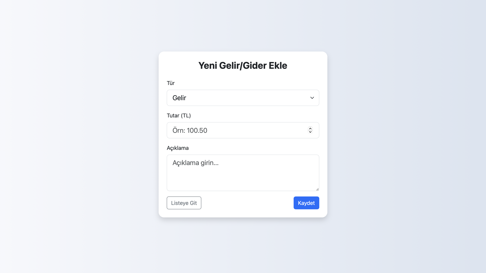

# Bütçe Takip Uygulaması

Basit ve kullanışlı bir kişisel bütçe takip sistemi. Gelirlerinizi ve giderlerinizi kolayca kaydedip, finansal durumunuzu anlık olarak görebilirsiniz.

---

## Özellikler

- Kullanıcı kaydı ve güvenli giriş
- Kişiye özel kullanıcı adı
- Gelir ve gider işlemlerini ekleme, düzenleme, silme
- Toplam gelir, toplam gider ve bakiye özet görünümü
- Son 5 işlemin listelenmesi
- Bootstrap 5 ile responsive ve modern tasarım

---

## Site Bağlantısı

Siteye buradan ulaşabilirsiniz: http://95.130.171.20/~st23360859019/

---

## YouTube Video Bağlantısı

Youtube videosuna buradan ulaşabilirsiniz: https://youtu.be/B5RhL-nIzao?si=obOgUw_G8yf8Z9w9

---

## Kullanım

- `register.php` sayfasından kayıt olun.
- `login.php` sayfasından giriş yapın.
- `index.php` sayfasında finansal özetinizi görün.
- `create_transaction.php` ile gelir/gider ekleyin.
- `list_transactions.php` sayfasında işlemlerinizi listeleyin, düzenleyin veya silin.
- `edit_transaction.php` sayfasında işlemi düzenleyin.
- `logout.php` ile çıkış yapın.

---

## Proje Dosyaları

| Dosya Adı              | Açıklama                                      |
|------------------------|-----------------------------------------------|
| `index.php`            | Ana sayfa, gelir-gider ve bakiye özeti       |
| `register.php`         | Kullanıcı kayıt sayfası                        |
| `login.php`            | Kullanıcı giriş sayfası                        |
| `logout.php`           | Oturumu kapatma                                |
| `create_transaction.php` | Yeni gelir veya gider işlemi ekleme           |
| `list_transactions.php` | İşlem listesini gösterme, silme ve düzenleme   |
| `edit_transaction.php`  | İşlem düzenleme sayfası                        |
| `delete_transaction.php`| İşlem silme scripti                            |
| `config_sample.php`    | Örnek veritabanı bağlantı ayarları (kopyalanıp `config.php` yapılacak) |
| `database.sql`         | Veritabanı ve tabloların oluşturulması için SQL dosyası |
| `/screenshots/`        | Uygulama ekran görüntüleri                      |

---

## Ekran Görüntüleri

### Giriş Sayfası  

### İşlem Listeleme  

### Ana Sayfa  

### İşlem Düzenleme  

### İşlem Ekleme  

